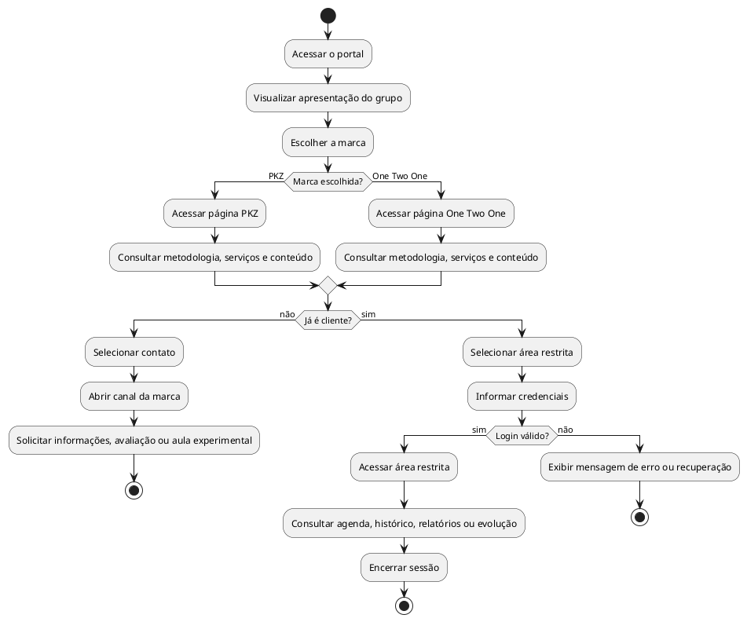

# AHT - Portal PKZ / One Two One

> Análise Hierárquica de Tarefas do website da PKZ (Playmakerz) e da One Two One.

## 1. Objetivo principal

**0. Utilizar o portal PKZ / One Two One para conhecer a empresa, escolher a marca adequada e realizar a ação desejada.**

## 2. Hierarquia de tarefas

### 0. Utilizar o portal

#### 1. Conhecer o grupo

- **1.1** Acessar a página inicial.
- **1.2** Visualizar a apresentação principal.
- **1.3** Entender que PKZ e One Two One pertencem ao mesmo grupo.
- **1.4** Consultar informações introdutórias sobre a empresa.

**Plano 1:** executar 1.1 -> 1.2 -> 1.3. Executar 1.4 quando o usuário desejar conhecer melhor o grupo antes de escolher uma marca.

#### 2. Escolher uma marca

- **2.1** Visualizar a opção PKZ.
- **2.2** Visualizar a opção One Two One.
- **2.3** Identificar qual proposta corresponde melhor ao perfil do usuário.
- **2.4** Selecionar a marca desejada.

**Plano 2:** executar 2.1 e 2.2; depois executar 2.3 e 2.4.

#### 3. Conhecer a PKZ

- **3.1** Acessar a página da PKZ.
- **3.2** Ler a apresentação da marca.
- **3.3** Conhecer o público e a metodologia.
- **3.4** Consultar serviços e avaliações.
- **3.5** Visualizar fotos e vídeos.
- **3.6** Conhecer a equipe.
- **3.7** Consultar perguntas frequentes.
- **3.8** Escolher entre entrar em contato ou acessar a área do atleta/responsável.

**Plano 3:** executar 3.1 -> 3.2 -> 3.3. As tarefas 3.4, 3.5, 3.6 e 3.7 podem ser realizadas conforme o interesse do usuário. Finalizar com 3.8 quando houver intenção de prosseguir.

#### 4. Conhecer a One Two One

- **4.1** Acessar a página da One Two One.
- **4.2** Ler a apresentação da marca.
- **4.3** Conhecer o público e a metodologia.
- **4.4** Consultar serviços e estrutura.
- **4.5** Visualizar fotos e vídeos.
- **4.6** Conhecer a equipe.
- **4.7** Consultar perguntas frequentes.
- **4.8** Escolher entre entrar em contato ou acessar a área do cliente.

**Plano 4:** executar 4.1 -> 4.2 -> 4.3. As tarefas 4.4, 4.5, 4.6 e 4.7 podem ser realizadas conforme o interesse do usuário. Finalizar com 4.8 quando houver intenção de prosseguir.

#### 5. Entrar em contato como novo interessado

- **5.1** Selecionar a ação de contato.
- **5.2** Escolher o canal disponibilizado.
- **5.3** Abrir o WhatsApp ou formulário correspondente à marca.
- **5.4** Solicitar informações, avaliação ou aula experimental.
- **5.5** Finalizar o contato.

**Plano 5:** executar 5.1 -> 5.2 -> 5.3 -> 5.4 -> 5.5.

#### 6. Acessar a área restrita como cliente

- **6.1** Selecionar "Área do cliente", "Área do atleta" ou opção equivalente.
- **6.2** Informar credenciais.
- **6.3** Solicitar entrada.
- **6.4** Verificar o resultado da autenticação.
- **6.5** Acessar a área restrita se os dados estiverem corretos.
- **6.6** Exibir mensagem de erro ou recuperação de acesso se os dados estiverem incorretos.

**Plano 6:** executar 6.1 -> 6.2 -> 6.3 -> 6.4. Se a autenticação for válida, executar 6.5. Caso contrário, executar 6.6 e retornar para 6.2 quando o usuário desejar tentar novamente.

#### 7. Consultar recursos da área restrita

- **7.1** Visualizar agenda.
- **7.2** Consultar agendamentos.
- **7.3** Consultar histórico de treinos.
- **7.4** Consultar relatórios.
- **7.5** Visualizar gráficos de evolução.
- **7.6** Ler observações associadas aos resultados.
- **7.7** Encerrar sessão.

**Plano 7:** executar apenas as tarefas disponíveis para o perfil do usuário. A tarefa 7.7 deve ser utilizada ao finalizar o acesso.

**Plano 0:**

1. Todo usuário inicia pela tarefa **1 - Conhecer o grupo**.
2. Em seguida, realiza a tarefa **2 - Escolher uma marca**.
3. Se escolher PKZ, realiza a tarefa **3 - Conhecer a PKZ**.
4. Se escolher One Two One, realiza a tarefa **4 - Conhecer a One Two One**.
5. Se for um novo interessado, realiza a tarefa **5 - Entrar em contato**.
6. Se já for cliente, realiza a tarefa **6 - Acessar a área restrita**.
7. Após autenticação, poderá realizar a tarefa **7 - Consultar recursos da área restrita**.

## 4. Fluxo resumido

```text
0. Utilizar o portal
|
+-- 1. Conhecer o grupo
|
+-- 2. Escolher uma marca
|   |
|   +-- PKZ ---------> 3. Conhecer a PKZ
|   |
|   +-- One Two One -> 4. Conhecer a One Two One
|
+-- Novo interessado -> 5. Entrar em contato
|
+-- Cliente atual ----> 6. Acessar área restrita
                        |
                        +-- 7. Consultar recursos
```

## 5. Diagrama de atividade em PlantUML



## 6. Observação de escopo

A AHT representa o fluxo completo planejado para o portal. As tarefas relacionadas à área restrita podem ser prototipadas na etapa de Front-End mesmo que a integração com autenticação, banco de dados, agenda e relatórios reais seja implementada somente em uma etapa posterior.
